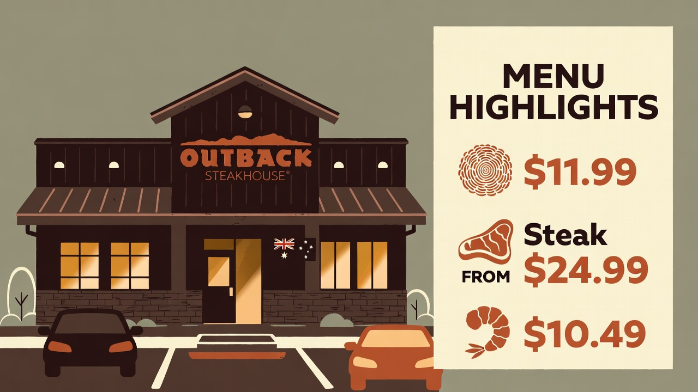
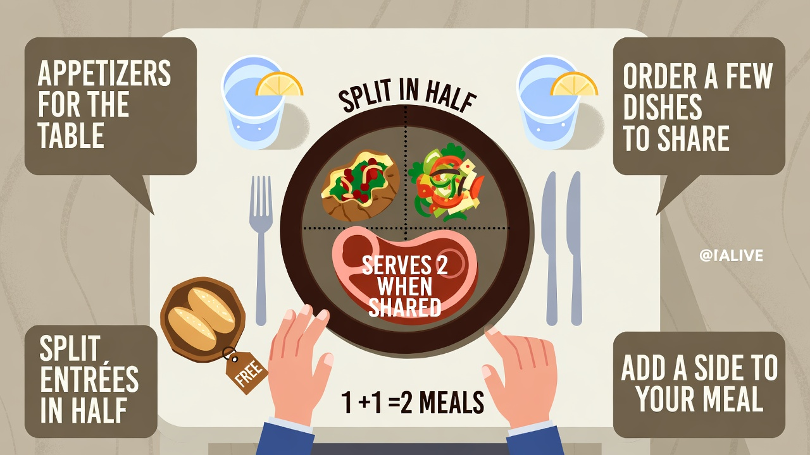
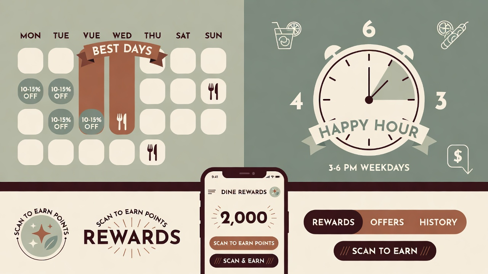
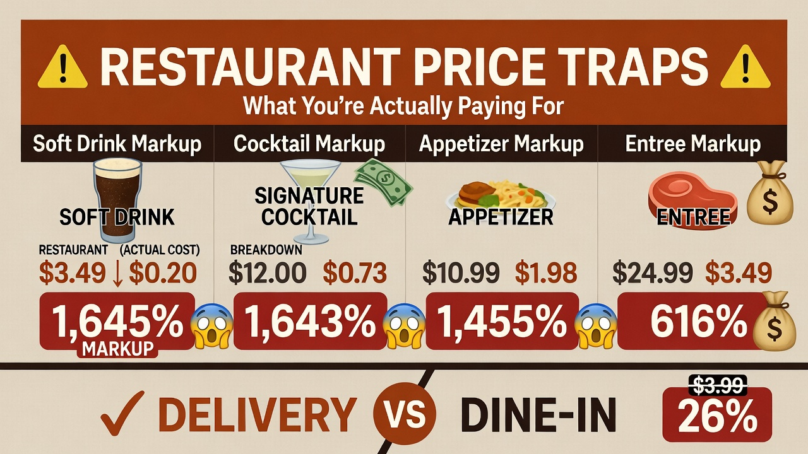
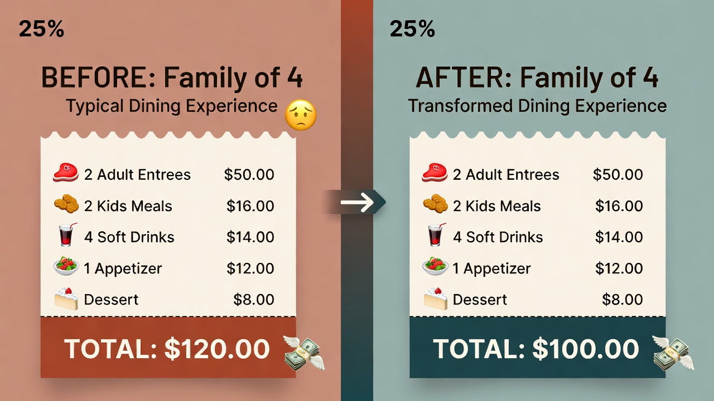

# How to Save Money at Outback Steakhouse: Menu Hacks and Hidden Deals

I've been eating at steakhouses across America for over 15 years. I've managed restaurants, analyzed pricing strategies, and spent way too much of my own money figuring out what actually works. Here's the truth: most people are overpaying at Outback Steakhouse — often by $30–50 per visit. That adds up fast when the average American family spends over $3,000 a year dining out.

A typical dinner for two can easily hit $80–100 before dessert or drinks. But you can cut that bill in half (or more) using strategies the restaurant doesn't advertise. These aren't basic coupon tips — these are real, tested methods that work today.

## Table of Contents

- [Understanding Outback's Pricing Structure](#understanding-outbacks-pricing-structure)
- [Menu Hacks That Actually Work](#menu-hacks-that-actually-work)
  - [1. The Appetizer Meal Strategy (My #1 Hack)](#1-the-appetizer-meal-strategy-my-1-hack)
  - [2. Lunch Menu Advantage](#2-lunch-menu-advantage)
  - [3. The Protein Swap & Customization Trick](#3-the-protein-swap--customization-trick)
  - [4. Drink Money Savers](#4-drink-money-savers)
  - [5. Strategic Sides Selection](#5-strategic-sides-selection)
- [Hidden Deals and Discount Programs](#hidden-deals-and-discount-programs)
- [Timing Is Everything](#timing-is-everything)
- [Advanced Techniques](#advanced-techniques)
- [Real-Life Savings Examples](#real-life-savings-examples)
- [Quick Start Checklist](#quick-start-checklist)

## Understanding Outback's Pricing Structure

Outback uses "value perception pricing." A $24 steak feels reasonable next to a $45 one at a premium chain, even though the actual cost difference to the restaurant isn't that large.

Key things most people miss:

- Prices vary significantly by region (same Bloomin' Onion might be $11.99 in Ohio but $13.99 in California or New York).
- Peak times cost more — weekend dinners are pricier than Tuesday lunch, even for the same meal.
- Dynamic pricing is quietly becoming more common (like airlines).

Always check the current [Outback Steakhouse menu with pricing](https://steakhousemenu.com/) before you go. Knowing prices ahead of time prevents expensive impulse decisions when you're hungry.

## Menu Hacks That Actually Work

### 1. The Appetizer Meal Strategy (My #1 Hack)

Outback appetizers offer insane value compared to entrées.

- Bloomin' Onion: $11.99 → easily feeds 4 people (~$3/person)
- Aussie Cheese Fries: $12.99 → dinner for two
- Kookaburra Wings: $11.49

**Pro move**: Order 1–2 appetizers as your main meal, or combine one appetizer + one shared entrée. You get variety, stay full, and spend half as much.

Most appetizers are 800–1,500 calories — that's a full meal. There's no rule saying you can't make them your entrée.

### 2. Lunch Menu Advantage

The lunch menu is Outback's best-kept secret.

- Lunch ribeye: ~$14.99 vs. dinner $24.99
- Still 6 oz of quality steak + two sides
- Available ~11 AM–4 PM weekdays (some locations until 5 PM)

**Early dinner hack**: Arrive around 4–4:30 PM and ask if lunch pricing still applies (sometimes yes, depending on location/server).

Smaller portion, 35–40% lower price — do the math.

### 3. The Protein Swap & Customization Trick

Outback is very flexible with modifications — and most are free or cheap.

- Swap sides: free (get the loaded baked potato or sweet potato instead of fries)
- Extra butter/sour cream on potato: free
- Add coconut shrimp to steak for $4.99 (instead of $10.49 standalone)
- Extra vegetables instead of potato: usually free

Ask politely. The kitchen wants happy customers.

### 4. Drink Money Savers

Drinks are the biggest profit center (80–90% markup on soda, 200–300% on alcohol).

- Fountain Coke costs ~$0.20 → sold for $3.49
- Water with lemon: **free**, refreshing, healthier

**Rule**: Skip paid drinks or limit to one per person. This alone cuts 20–30% off the bill.

Happy hour (if offered): 3–6 PM weekdays — drinks and apps 20–30% off.

### 5. Strategic Sides Selection

Every entrée includes two sides. Choose smart:

- Premium included sides (loaded potato, sweet potato) give more value
- Avoid paid add-ons like mac & cheese ($2.99) or mushrooms ($3.99)

**Pro move**: Ask for extra bread, butter, or vegetables — often free.

## Hidden Deals and Discount Programs

### Dine Rewards Program

Free to join — works at Outback, Carrabba's, Bonefish Grill, Fleming's.

- $10 signup bonus (most markets)
- Earn points: ~$200 spent = $10 back (5% return)
- Birthday: free appetizer or dessert
- App offers: 20% off entire check, BOGO entrées, free apps

**Pro move**: Stack with everything else (gift cards, promotions, credit card rewards).

### Discounted Gift Cards

Never buy at face value:

- Costco/Sam's Club: $100 cards for ~$79.99 (20% off)
- Raise.com / CardCash.com: 8–15% off regularly

Stack with Dine Rewards → save 20% upfront + earn 5% back.

### Survey Receipts

Every receipt has a survey code → complete it → get free appetizer ($10–12 value) on next visit.

Takes 3 minutes. Keep codes in your phone/wallet. Perpetual free appetizers.

### Seasonal & Local Promotions

- Steak & Unlimited Shrimp (~$17.99)
- Holiday specials (Father's Day, etc.)
- Kids eat free nights (often Mon/Tue — call your location)

Follow your local Outback on Facebook/Instagram — flash deals appear there first.

## Timing Is Everything

- **Best days**: Tuesday & Wednesday (slowest → best chance for unadvertised specials)
- **Happy hour**: 3–6 PM weekdays (some until 7 PM) — discounted apps/drinks
- **Avoid**: Friday/Saturday nights (peak pricing, longer waits)

Early (4–6 PM) or late (after 9 PM) can sometimes unlock lunch pricing or discounted apps.

## Advanced Techniques

- **Pre-dinner snack**: Eat something small 30 min before → avoid hunger-driven overspending
- **BYOB** (where allowed): $10–15 corkage vs. $60–75 restaurant bottle
- **Credit card stacking**: 3–4x points on dining (Amex Gold, Chase Sapphire, etc.)
- **Delivery avoidance**: Takeout pickup saves $15–20 vs. DoorDash/Uber Eats

## Real-Life Savings Examples

**Family of 4**  
Before: $120 → After (5 strategies): $36 → **Saved $84 (70%)**

**Date Night Couple**  
Before: $103 → After (sharing + discounted gift card): $40 out-of-pocket → **Saved $63 (61%)**

**Solo Diner**  
Before: $34 → After (lunch + rewards): $18 → **Saved $16 (47%)**

## Quick Start Checklist

1. Join Dine Rewards & download the app
2. Buy discounted gift cards (Costco/Raise)
3. Check current menu & deals online
4. Visit Tue/Wed or during happy hour
5. Order appetizer + shared entrée or lunch portion
6. Drink water, choose premium included sides
7. Complete survey for free appetizer next time

Start with 2–3 strategies on your next visit. Track what you save — you'll be surprised how fast it adds up.

Dining out should be enjoyable, not stressful. Use these hacks, enjoy your Bloomin' Onion and steak, and keep more money in your pocket.

You've got this.

---
**Questions or your own hacks?** Drop them in the comments below.  
**Found this helpful?** Bookmark it for your next Outback visit and share it with friends who love steak but hate overspending.
